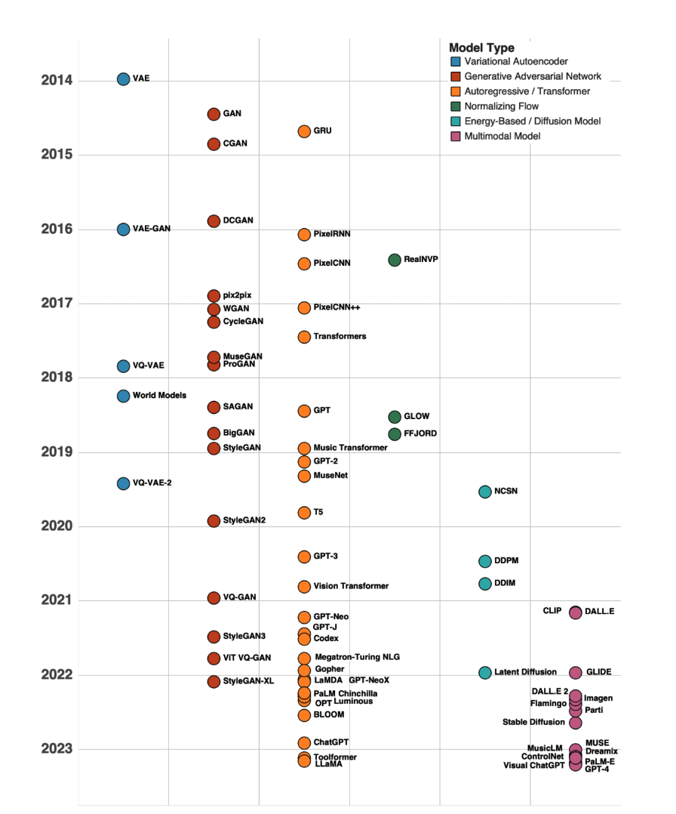
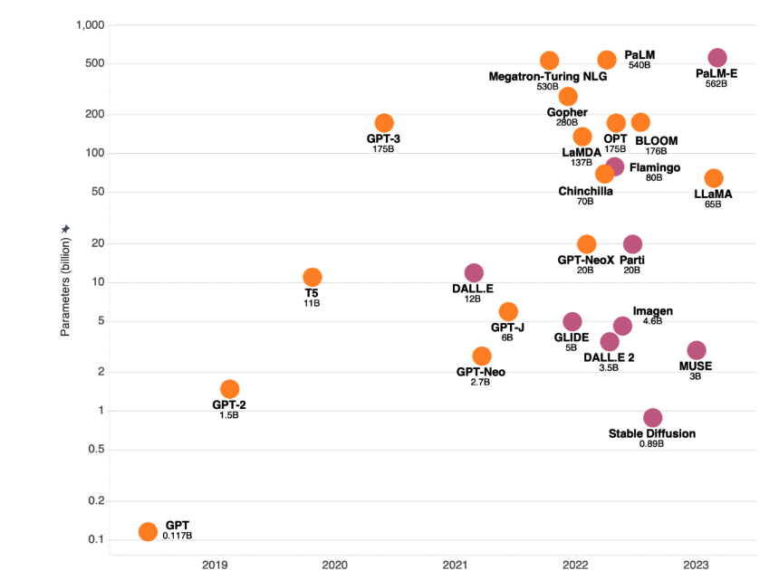
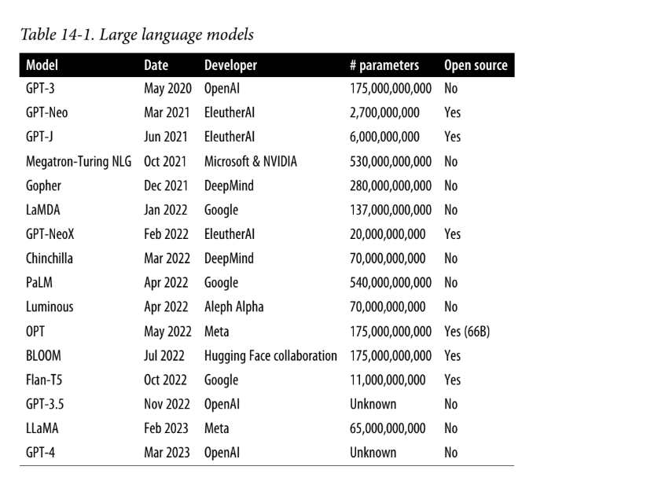

# GenAI Projects

Generative AI · Agentic Systems · RAG · NLP · LLM Engineering   21 Projects · 21 Courses

## 🤖 AI & GenAI Projects

 

|  #  | Project                         | Topic                                             |                                                                                               Stack                                                                                                |                                                         Course                                                          | Status |
| :-: | :------------------------------ | :------------------------------------------------ | :------------------------------------------------------------------------------------------------------------------------------------------------------------------------------------------------: | :---------------------------------------------------------------------------------------------------------------------: | :----: |
|  1  | `gpt-from-scratch`              | ChatGPT-style LM from scratch · _LLM Engineering_ |                                                                                                     |      [📖](https://www.analyticsvidhya.com/courses/coding-a-chatgpt-style-language-model-from-scratch-in-pytorch/)       |   📋   |
|  2  | `qa-rag-langchain`              | Q&A RAG with vector store · _RAG_                 |                                                                                               |                   [📖](https://www.analyticsvidhya.com/courses/build-a-qa-rag-system-with-langchain/)                   |   📋   |
|  3  | `document-retriever-langchain`  | Document retrieval with embeddings · _RAG_        |                                                                                               |         [📖](https://www.analyticsvidhya.com/courses/build-a-document-retriever-search-engine-with-langchain/)          |   📋   |
|  4  | `rag-llamaindex`                | RAG pipeline from scratch · _RAG_                 |                                                                                                            |               [📖](https://www.analyticsvidhya.com/courses/building-first-rag-systems-using-llamaindex/)                |   📋   |
|  5  | `scalable-rag-agents`           | Industry-scale RAG + agents · _RAG_               |                                                                                                        |   [📖](https://www.analyticsvidhya.com/courses/Building-Scalable-Industry-Applications-with-RAG-and-Agentic-Systems)    |   📋   |
|  6  | `crewai-researcher`             | CrewAI researcher assistant · _Agentic AI_        |                        |       [📖](https://www.analyticsvidhya.com/courses/introduction-to-crewai-building-a-researcher-assistant-agent/)       |   📋   |
|  7  | `resume-review-agent`           | Resume evaluation pipeline · _Agentic AI_         |                        |             [📖](https://www.analyticsvidhya.com/courses/build-a-resume-review-agentic-system-with-crewai/)             |   📋   |
|  8  | `multi-agent-system`            | Collaborative task solving · _Multi-Agent_        |                                                                                                        |        [📖](https://www.analyticsvidhya.com/courses/building-a-collaborative-multi-agent-system-with-langgraph)         |   📋   |
|  9  | `adaptive-email-agents-dspy`    | Adaptive email agents with DSPy · _Agentic AI_    |                            |                     [📖](https://www.analyticsvidhya.com/courses/adaptive-email-agents-with-dspy/)                      |   📋   |
| 10  | `agent-autogen`                 | Agent orchestration with AutoGen · _Agentic AI_   |                      |                       [📖](https://www.analyticsvidhya.com/courses/building-agent-using-autogen/)                       |   📋   |
| 11  | `problem-solving-agents`        | Problem-solving agents with GenAI · _Agentic AI_  |                                                                                                        |    [📖](https://www.analyticsvidhya.com/courses/creating-problem-solving-agents-using-genai-for-action-composition/)    |   📋   |
| 12  | `data-analyst-agent`            | Automated data analysis · _Agentic AI_            |   |                      [📖](https://www.analyticsvidhya.com/courses/building-data-analyst-AI-agent/)                      |   📋   |
| 13  | `genai-on-aws`                  | GenAI case study on AWS · _GenAI Apps_            |          |                           [📖](https://www.analyticsvidhya.com/courses/generative-ai-on-aws/)                           |   📋   |
| 14  | `strands-agents`                | Getting started with Strands · _Agentic AI_       |                      |      [📖](https://www.analyticsvidhya.com/courses/getting-started-with-strands-agents-build-your-first-ai-agent/)       |   📋   |
| 15  | `agentic-ai-bedrock`            | Agentic AI system on AWS Bedrock · _Agentic AI_   |                                                                                               |               [📖](https://www.analyticsvidhya.com/courses/building-agentic-ai-system-with-with-bedrock/)               |   📋   |
| 16  | `deep-research-ai-agent`        | Deep research pipeline · _Agentic AI_             |                                                                                                        |                    [📖](https://www.analyticsvidhya.com/courses/building-a-deep-research-ai-agent/)                     |   📋   |
| 17  | `multi-agent-system-ii`         | Advanced collaborative agents · _Multi-Agent_     |                                                                                                        |        [📖](https://www.analyticsvidhya.com/courses/building-a-collaborative-multi-agent-system-with-langgraph/)        |   📋   |
| 18  | `distilbert-sentiment-pipeline` | Production sentiment pipeline · _NLP_             |       | [📖](https://www.analyticsvidhya.com/courses/building-a-sentiment-classification-pipeline-with-distilbert-and-airflow/) |   📋   |
| 19  | `newsletter-ai-agent`           | Personalized newsletter pipeline · _Agentic AI_   |                                                                                                        |                [📖](https://www.analyticsvidhya.com/courses/building-a-customized-newsletter-ai-agent/)                 |   📋   |
| 20  | `intelligent-chatbots`          | LLM-powered chatbot systems · _GenAI Apps_        |                                                                                                        |                  [📖](https://www.analyticsvidhya.com/courses/building-intelligent-chatbots-using-ai)                   |   📋   |
| 21  | `openengage-marketing-engine`   | AI-driven marketing engine · _GenAI Apps_         |                                                                                                        |             [📖](https://www.analyticsvidhya.com/courses/openengage-a-complete-ai-driven-marketing-engine/)             |   📋   |

## 🛠 Stack

 

## 📚 Resources

 

| # | Resource | Type | Link |
| :-: | :------- | :--- | :--: |
| 1 | GenAI Course Playlist | YouTube Series | [▶️](https://www.youtube.com/playlist?list=PLJq-63ZRPdBu38EjXRXzyPat3sYMHbIWU) |
| 2 | Generative Deep Learning, 2nd Ed. — David Foster | Book (O'Reilly) | [📖](https://www.oreilly.com/library/view/generative-deep-learning/9781098134174/) |

## 🕰 Timeline of Generative AI

> Summary from *Generative Deep Learning, 2nd Ed.* — Chapter 14

The history of modern generative AI can be broken into three eras, each defined by a
dominant architecture and a step-change in capability.

*Fig. 14-1 — A brief history of generative AI from 2014 to 2023 (source: Generative Deep Learning, 2nd Ed.)*

### Era 1 · 2014–2017: The VAE and GAN Era

The **VAE** (2013) was the spark — it demonstrated smooth latent-space traversal for image generation. The **GAN** (2014) followed with an entirely new adversarial framework. The next three years were dominated by GAN extensions:

- Architecture improvements: **DCGAN** (2015), **ProGAN** (2017)
- Loss improvements: **Wasserstein GAN** (2017)
- New domains: **pix2pix** and **CycleGAN** (image translation), **MuseGAN** (music)
- VAE advances: **VAE-GAN** (2015), **VQ-VAE** (2017), **World Models** (2018)
- Autoregressive image generation: **PixelRNN / PixelCNN** (2016), **RealNVP** (2016)

The era closed with *"Attention Is All You Need"* (June 2017), which introduced the Transformer.

### Era 2 · 2018–2019: The Transformer Era

The **Transformer's** attention mechanism replaced recurrent layers and scaled far better. Key milestones: **GPT / BERT** (2018), **Music Transformer / MuseNet**, **SAGAN / BigGAN**, **StyleGAN / StyleGAN2**, **GPT-2** (1.5B), **T5** (11B), and the score-based **NCSN** (2019) — a precursor to diffusion models.

### Era 3 · 2020–2022: The Big Model Era

Two parallel explosions — **massive language models** and **diffusion models** — that then fused into **multimodal models**.

**Diffusion models:** **DDPM / DDIM** (2020) rivalled GANs with a simpler single-network setup. **Latent Diffusion** (2021) powered **Stable Diffusion** (2022, open source).

**Large language models:**

*Fig. 14-3 — LLM (orange) and multimodal model (pink) parameter counts over time (source: Generative Deep Learning, 2nd Ed.)*

*Table 14-1 — Large language models (source: Generative Deep Learning, 2nd Ed.)*

**Multimodal models:** **CLIP + DALL·E** (2021), **GLIDE** (2021), **DALL·E 2** (2022), **Imagen / Parti / MUSE** (Google, 2022–23), **Flamingo** (DeepMind, 2022), **Stable Diffusion** (2022, open source).

### Current State

LLMs now dominate text generation — every task is framed as text-to-text, the model predicts the next token given a prompt. Parameter counts grew exponentially through 2021, then the focus shifted to **efficiency**. The GPT family (OpenAI) remains the most widely used suite; **LLaMA** (Meta) is the leading open-source alternative.
